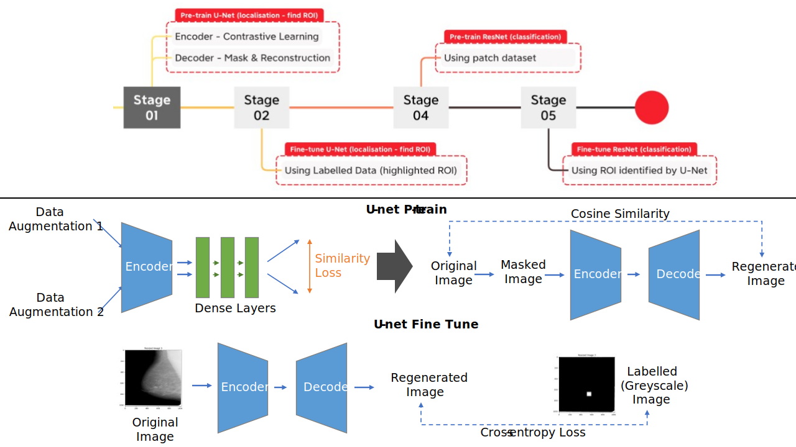

# DLMammoClassifier-Summer2023
Imperial College London Summer 2023 Group Consultancy Project

## Overview

This repository contains the code and resources for the development of a mammography classification system using deep learning techniques. The project is carried out by a group of students from Imperial College London during the Summer of 2023.

## Timeline and Work Distribution

- [Week 1: Team Onboarding](docs/week1.md)
- [Week 2: Client Consultation, Project Planning and Data Collection](docs/week2.md)
- [Week 3: Data Preprocessing, Preliminary Research and Baseline Model Implementation](docs/week3.md)

## Dataset

| Name | Size | Label | Localisation |
| --- | :---: | :---: | :---: |
| [CBIS-DDSM](https://wiki.cancerimagingarchive.net/pages/viewpage.action?pageId=22516629#2251662935562334b1e043a3a0512554ef512cad) | 2620 | :heavy_check_mark: | :heavy_check_mark: |
| [InBreast](https://www.kaggle.com/datasets/martholi/inbreast?select=inbreast.tgz) | 410 | :heavy_check_mark: | :x: |
| [MIAS](http://peipa.essex.ac.uk/info/mias.html) | 322 | :heavy_check_mark: | :heavy_check_mark: |
| [Breast-Cancer-Screening-DBT](https://wiki.cancerimagingarchive.net/pages/viewpage.action?pageId=64685580#6468558050a1e1bdf0de46de92128576e1d3e9b1) | 5060 | :heavy_check_mark: | :heavy_check_mark: |
| [BCDR](https://bcdr.eu/information/downloads) | 956 | :heavy_check_mark: | :heavy_check_mark: |
| [CDD-CESM](https://wiki.cancerimagingarchive.net/pages/viewpage.action?pageId=109379611) | 326 | :heavy_check_mark: | :heavy_check_mark: |
| [CMMD](https://wiki.cancerimagingarchive.net/pages/viewpage.action?pageId=70230508) | 1775 | :heavy_check_mark: | :x: |
| [Duke Breast Cancer MRI](https://wiki.cancerimagingarchive.net/pages/viewpage.action?pageId=70226903) | 922 | :heavy_check_mark: | :x: |
| [King Abdulaziz](https://www.mdpi.com/2306-5729/6/11/111#) | 1416 | :heavy_check_mark: | :heavy_check_mark: |
| [Embed](https://pubs.rsna.org/doi/10.1148/ryai.220047) | 340000 | :heavy_check_mark: | :x: |
| [OMI-DB](https://www.cancerresearchhorizons.com/licensing-opportunities/optimam-mammography-image-database-omi-db) | 2620 | :heavy_check_mark: | :x: |

## File Structure

    DLMammoClassifier-Summer2023/
    └── data/                                       # Datasets
    └── docs/                                       # Weekly documentations
        ├── week1.md
        └── ...
    └── scratch/                                    # Initial trials on google colab
    └── train/                                      # Codes to build and train the model
        ├── Mammolibs/                                  # Custom libraries used in this project
        |   ├── __init__.py
        │   ├── MMmodels.py
        │   ├── MMdataset.py
        |   └── MMutils.py
        ├── unet/                                       # U-Net for segmentation
        |   ├── encoder/
        |   |   ├── train_decoder.py
        |   |   ├── model_epoch_200.pth
        |   |   └── ...
        |   ├── autoencoder/
        |   |   └── ...
        |   └── finetune.py
        ├── classifier/                                 # Resnet for local classification
        |   ├── resnet/
        |   |   ├── train_decoder.py
        |   |   ├── model_epoch_200.pth
        |   |   └── ...
        |   └── finetune.py
        └── train.sh                                    # Script to train all models
    └── README.md
    └── requirements.txt

## Algorithms and Training Pipeline

## User Menu

> **Note:** Only support TPU training at this stage. CPU and GPU support is expected to come in soon.
1. Git clone the repo, then `cd DLMammoClassifier-Summer2023`, all the command is relative to this path.

2. Pre-train Encoder:

	- Start from scratch: `sudo PJRT_DEVICE=TPU python3 train/unet/encoder/train_encoder.py --pretrain no 2>&1 | grep -v "^tcmalloc"`
	- Start from saved state_dict: `sudo PJRT_DEVICE=TPU python3 train/unet/encoder/train_encoder.py --pretrain 20 2>&1 | grep -v "^tcmalloc"`
    > Args\
        `--pretrain: no / number of iterations of saved state_dict`\
        `--lr(optional) learning rate`\
        `--it(optional) how many iterations you want to train further`
3. Pre-train Autoencoder
	- Start from pre-trained decoder: `sudo PJRT_DEVICE=TPU python3 train/unet/autoencoder/train_autoencoder.py --pretrain no --encoder 20 2>&1 | grep -v "^tcmalloc"`
	- Start from saved state_dict: `sudo PJRT_DEVICE=TPU python3 train/unet/autoencoder/train_autoencoder.py --pretrain 10 2>&1 | grep -v "^tcmalloc"`
    > Args\
        `--pretrain: no / number of iterations of saved state_dict`\
        `--encoder(optional) if no start from scratch, load encoder state_dict`\
        `--lr(optional) learning rate`\
        `--it(optional) how many iterations you want to train further`

## Progress

- [x] Algorithms and Training Pipeline
- [x] Model Architecture
- [x] Data Unification
- [x] Cloud Platform
- [x] Upload Data to GCP Cloud Storage Buckets
- [x] Algorithms Test with Local Sample Data
- [x] Store Model Parameters
- [x] TPU Singlecore Support
- [x] TPU Multicore Support
- [x] Train Model using Data in GCP Cloud Storage Buckets
- [ ] Tramsfer Learning
- [ ] Shell Scripts
- [ ] Full Model Complete
- [ ] Pretrain Encoder Complete
- [ ] Pretrain Autoencoder Complete
- [ ] Pretrain Classifier Complete
- [ ] Finetune U-Net
- [ ] Finetune Classifier
- [ ] First Iteration of Complete Model