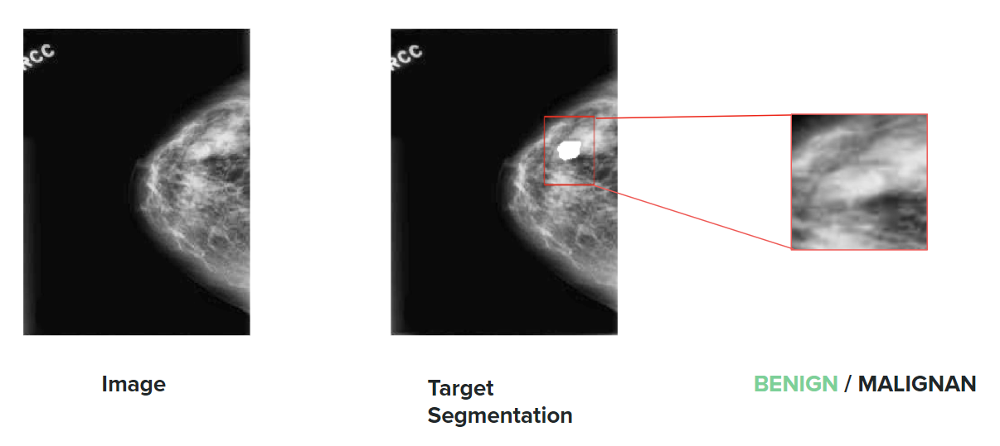

# DLMammoClassifier-Summer2023
Imperial College London Summer 2023 Group Consultancy Project

## Overview

This repository contains the code and resources for the development of a mammography classification system using deep learning techniques. The project is carried out by a group of students from Imperial College London during the Summer of 2023.

## Client Requirement

To develop a deep learning strategy and algorithm to detect malignant breast tumors with high accuracy and with the minimum possible false positive rate.  The algorithm must be able to generalise to unseen data that stems from a different dataset or population than that used to train the initial models.

## Design Plan, Solutions and Final Output:
- Collect as much data as possible to get diverse and sufficient data for training a high-accuracy model that generalise well.
    1. Standardise all the relative open datasets to get diverse and high-quality data.
        - Used in the pipeline to increase the size of the dataset:
    2. Augmentations to enrich the dataset:
        - Used in the pipeline since it significantly improved the generalisation of the model.
    3. Generative Models to generate datasets:
        - Rejected because of unable to verify the truthfulness of generated data.
    4. Insertion of manual tumors to normal mammography images:
        - Rejected because of difficulty in deploying the algorithm and cannot guarantee the quality of the generated dataset.
- Develop algorithms that can learn effectively with limited data and generalise well.
    1. Utilise self-supervise learning with unlabelled data:
        - Used in the pipeline since it significantly improves model performance.
    2. Use a two-stage model:
        - Used in the pipeline since the subtasks are more specific and easy to learn.
    3. Use of transformer architecture:
        - Rejected because this kind of architecture usually requires much more data and training time, the improvement over CNN is often very small.
    
## Timeline and Work Distribution

- [Week 1: Team Onboarding](docs/week1.md)
- [Week 2: Client Consultation, Project Planning and Data Collection](docs/week2.md)
- [Week 3: Data Preprocessing, Preliminary Research and Baseline Model Implementation](docs/week3.md)
- [Week 4: Pretraining and Two-Stage Model Implementation](docs/week4.md)
- [Week 5: Encoder Training, Loss Testing, Hyperparameter Adjustment, and Network Development](docs/week5.md)
- [Week 6: Autoencoder Training, Network Fine-tuning, Evaluation Code, Data Visualization, and Project Setup Procedure](docs/week6.md)
- [Week 7: ResNet Pretraining, Fine-tuning, and Snip Dataset Generation](docs/week7.md)
- [Week 8: Model Training and Loss Monitoring](docs/week8.md)
- [Week 9: Model Weight Obtained and UI Development](docs/week9.md)

## Dataset

| Name | Size | Label | Localisation |
| --- | :---: | :---: | :---: |
| [CBIS-DDSM](https://wiki.cancerimagingarchive.net/pages/viewpage.action?pageId=22516629#2251662935562334b1e043a3a0512554ef512cad) | 10239 | :heavy_check_mark: | :heavy_check_mark: |
| [InBreast](https://www.kaggle.com/datasets/martholi/inbreast?select=inbreast.tgz) | 410 | :heavy_check_mark: | :x: |
| [MIAS](http://peipa.essex.ac.uk/info/mias.html) | 322 | :heavy_check_mark: | :heavy_check_mark: |
| [Breast-Cancer-Screening-DBT](https://wiki.cancerimagingarchive.net/pages/viewpage.action?pageId=64685580#6468558050a1e1bdf0de46de92128576e1d3e9b1) | 22032 | :heavy_check_mark: | :heavy_check_mark: |
| [BCDR](https://bcdr.eu/information/downloads) | 956 | :heavy_check_mark: | :heavy_check_mark: |
| [CDD-CESM](https://wiki.cancerimagingarchive.net/pages/viewpage.action?pageId=109379611) | 2006 | :heavy_check_mark: | :heavy_check_mark: |
| [CMMD](https://wiki.cancerimagingarchive.net/pages/viewpage.action?pageId=70230508) | 5202 | :heavy_check_mark: | :x: |
| [Duke Breast Cancer MRI](https://wiki.cancerimagingarchive.net/pages/viewpage.action?pageId=70226903) | 773888 | :heavy_check_mark: | :x: |
| [King Abdulaziz](https://www.mdpi.com/2306-5729/6/11/111#) | 2378 | :heavy_check_mark: | :heavy_check_mark: |
| [Embed](https://pubs.rsna.org/doi/10.1148/ryai.220047) | 68000 | :heavy_check_mark: | :x: |
| [OMI-DB](https://www.cancerresearchhorizons.com/licensing-opportunities/optimam-mammography-image-database-omi-db) | 2620 | :heavy_check_mark: | :x: |

## File Structure

    DLMammoClassifier-Summer2023/
    └── dataset_enhancement/                        # Code for data augmentation
    	├── DICOMExtract.py
     	└── ...
    └── docs/                                       # Weekly documentations
        ├── week1.md
        └── ...
    └── scratch/                                    # Initial trials on google colab
    └── Mammolibs/                                  # Custom libraries used in this project
        |   ├── __init__.py
        │   ├── MMmodels.py
        │   ├── MMdataset.py
        |   └── MMutils.py
        └── setup.py
    └── train/                                      # Codes to build and train the model
        ├── unet/                                       # U-Net for segmentation
        |   ├── encoder/
        |   |   ├── train_decoder.py
        |   |   ├── model_epoch_200.pth
        |   |   └── ...
        |   ├── autoencoder/
        |   |   └── ...
        |   └── finetune.py
        ├── classifier/                                 # Resnet for local classification
        |   ├── resnet/
        |   |   ├── train_decoder.py
        |   |   ├── model_epoch_200.pth
        |   |   └── ...
        |   └── finetune.py
        └── train.sh                                    # Script to train all models
    └── README.md
    └── requirements.txt

## Algorithms and Training Pipeline

## User Menu

> **Note:** Only support TPU training at this stage. CPU and GPU support is expected to come in soon.
1. Git clone the repo: `git clone https://github.com/Charliexlj/DLMammoClassifier-Summer2023`, then `cd DLMammoClassifier-Summer2023`, all the command is relative to this path.

2. Install all the dependencies: `pip install -r requirements`

3. Pre-train Encoder:
	- Start from scratch: `sudo PJRT_DEVICE=TPU python3 train/unet/encoder/train_encoder.py --pretrain no 2>&1 | grep -v "^tcmalloc"`
	- Start from saved state_dict: `sudo PJRT_DEVICE=TPU python3 train/unet/encoder/train_encoder.py --pretrain 20 2>&1 | grep -v "^tcmalloc"`
    > Args\
        `--pretrain: no / number of iterations of saved state_dict`\
        `--lr(optional) learning rate`\
        `--it(optional) how many iterations you want to train further`
4. Pre-train Autoencoder
	- Start from pre-trained decoder: `sudo PJRT_DEVICE=TPU python3 train/unet/autoencoder/train_autoencoder.py --pretrain no --encoder 20 2>&1 | grep -v "^tcmalloc"`
	- Start from saved state_dict: `sudo PJRT_DEVICE=TPU python3 train/unet/autoencoder/train_autoencoder.py --pretrain 10 2>&1 | grep -v "^tcmalloc"`
    > Args\
        `--pretrain: no / number of iterations of saved state_dict`\
        `--encoder(optional) if no start from scratch, load encoder state_dict`\
        `--lr(optional) learning rate`\
        `--it(optional) how many iterations you want to train further`
5. Fine-tune UNet
	- Start from pre-trained autoencoder: `sudo PJRT_DEVICE=TPU python3 train/unet/finetune.py --pretrain no --autoencoder 20 2>&1 | grep -v "^tcmalloc"`
	- Start from saved state_dict: `sudo PJRT_DEVICE=TPU python3 train/unet/finetune.py --pretrain 10 2>&1 | grep -v "^tcmalloc"`
    > Args\
        `--pretrain: no / number of iterations of saved state_dict`\
        `--auencoder(optional) if no start from scratch, load encoder state_dict`\
        `--lr(optional) learning rate`\
        `--it(optional) how many iterations you want to train further`

6. Train ResNet
	- Start directly: `sudo PJRT_DEVICE=TPU python3 train/resnet/train_resnet.py 2>&1 | grep -v "^tcmalloc"`
    > Args\
        `--lr(optional) learning rate`\
        `--it(optional) how many iterations you want to train further`

5. Evaluation
    - Use `sudo python3 /path/to/model/eval.py`, for example: `sudo python3 train/resnet/eval.py`
    - Type in the terminal the iteration of the model you want to evaluate after printing `Model Iter:`
    - Performance information will be printed in the terminal based on a batch of 128 test images.
    - For Autoencoder, UNet, and Resnet, a plot of 4 samples will be generated for inspection at /path/to/model/plot.png.

7. Weights
    - After training at each stage, a line of `/path/to/model/model_iter_*.pth saved successfully` will be printed on the terminal.
    - Model weights can be found in this directory and exported individually.
    - When using model weights for other purposes, just initialise the model using `model = MMmodels.[model_name]()` and load the corresponding state dict.
    - The final weight of our model can be found in `train/unet/model_iter_80.pth` and `train/resnet/model_iter_200.pth`, the two files can be downloaded directly from GitHub.

## Loss Curves with or without Pre-training:

## Model Illustration:

## Model User Interface:

## Progress

- [x] Algorithms and Training Pipeline
- [x] Model Architecture
- [x] Data Unification
- [x] Cloud Platform
- [x] Upload Data to GCP Cloud Storage Buckets
- [x] Algorithms Test with Local Sample Data
- [x] Store Model Parameters
- [x] TPU Singlecore Support
- [x] TPU Multicore Support
- [x] Train Model using Data in GCP Cloud Storage Buckets
- [x] Transfer Learning
- [ ] Shell Scripts
- [x] Full Model Complete
- [x] Pretrain Encoder Complete
- [x] Pretrain Autoencoder Complete
- [x] Pretrain Classifier Complete
- [x] Finetune U-Net
- [x] Finetune Classifier
- [x] First Iteration of Complete Model
- [x] Data Visualisation
- [x] Working Model Complete
- [x] User Interface Design

## Ethical Implications

Using mammograms to train machine learning models for breast cancer detection has significant ethical implications. On the one hand, we believe that the use of machine learning can significantly improve the accuracy and efficiency of breast cancer detection and potentially save lives through early detection. However, these benefits must be balanced against privacy and consent concerns. Mammograms are sensitive personal health data. Without the clear and informed consent of patients, the use of these images for research purposes may violate their right to privacy. In addition, there is a risk of misuse or violation of data protection regulations. As we have only used data that was already in the public domain for this project, we did not directly have to address these privacy concerns. It is nonetheless important to be aware of the importance of data privacy in medical research and its growing importance across the whole machine learning domain.
