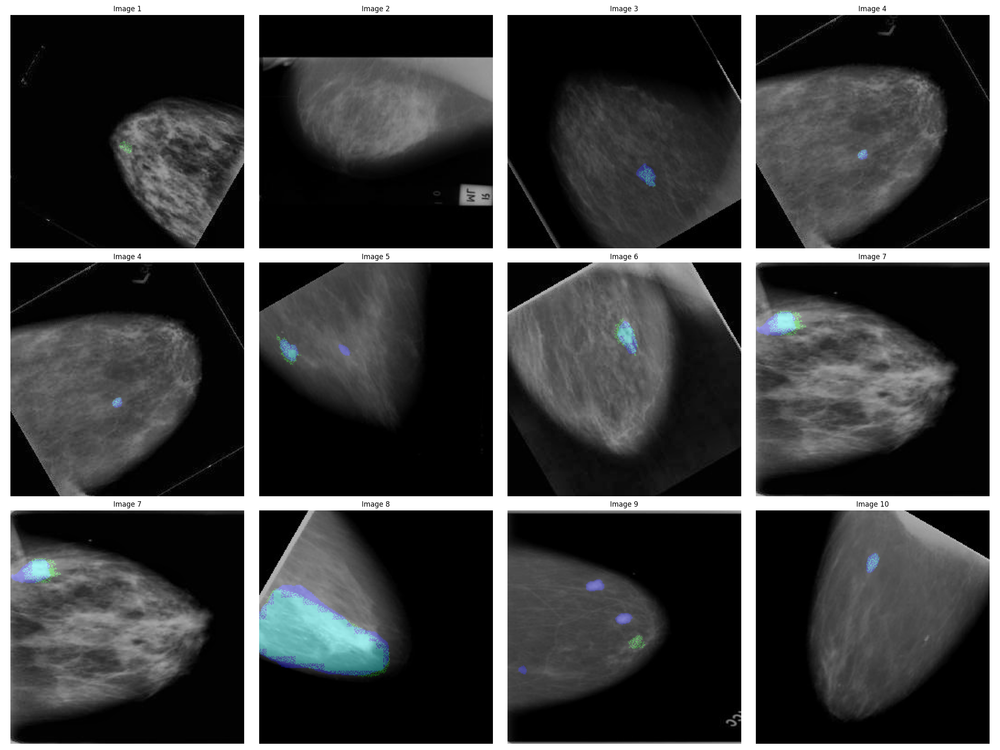

# Week 8: Model Training and Loss Monitoring

During the seventh week of the project, we made progress in building a ResNet for pretraining, further fine-tuning the network, and generating a snip dataset. In the eighth week, our primary focus is on training the model, as it requires a significant amount of time to learn from the data. Additionally, we emphasize monitoring the training process by inspecting the training and validation losses and utilizing visualization techniques. This document provides an overview of our progress and outlines the tasks accomplished during Week 8.

### 1. Model Training:
   - We dedicate this week to training the model using the collected dataset. Training the model involves optimizing the network's parameters to minimize the chosen loss function and improve its ability to detect objects accurately. The training process involves feeding the data through the model, computing gradients, and updating the weights iteratively.

### 2. Loss Monitoring:
   - Throughout the training process, we continuously monitor the training and validation losses. The training loss indicates how well the model is fitting the training data, while the validation loss provides insights into the model's generalization performance on unseen data. By tracking the loss values, we gain valuable information about the model's progress and convergence.
   

### 3. Data Visualization:
   - We employ visualization techniques to analyze the model's learning progress. This includes visualizing the training and validation losses over time, enabling us to identify trends, spot overfitting or underfitting issues, and make informed decisions for further optimization. Visualizing the loss curve helps us understand the model's performance and guide our training strategy.

   
